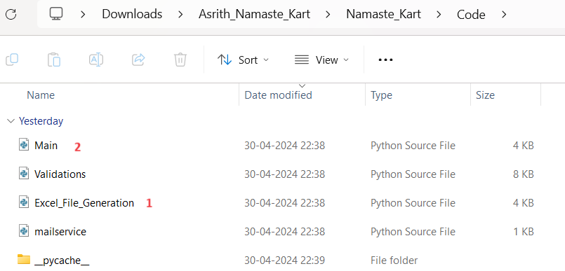

# Python_Namaste_Kart
This project is part of Namaste Python course

## Description : 

https://github.com/Asrith-Ladi/Python_Namaste_Kart/blob/main/Project%20Description

# Libraries I used :

1. Openpyxl
2. Datetime
3. Shutil
4. Os
5. Sys
6. Random
# Validations.py

## Functions :

**column_values(file_path,file_name,column_name)** -> requires file's path, file name, column_name and it returns the columunar values. Column can exist any where, function will search index based on column name and grab column values.

**validate_product_id_existed(product_id)** -> checks where file's product_id existed in master table and returns boolean value

**validate_sales(product_id,product_quantity,product_sales)** ->  checks total sales amount should be (product price from product master table * quantity) and returns boolean value

**validate_order_date(order_date)** -> checks the order date should not be in future and returns boolean value.

**validate_emptiness(row_values)** -> checks any field should not be empty and returns boolean value.

**validate_city(city)** -> checks The orders should be from Mumbai or Bangalore only and returns boolean value

**validations(file_path,file_name,reject_path)** -> receives the file and validate the above conditions. If all conditions are met then it moved to success folder and if any condition fails, it fall under reject folder with name error_filename.

# Main.py

Paths declared.

Checks length of incoming folder, and validates all conditions, if any failed then moved to rejected folder with same name and it succeed then move to success folder.

# How can I see the results?

1. Download the Asrith_Namaste_Kart.zip file and unzip it.
2. Go to Asrith_Namaste_Kart\Namaste_Kart\Code as shown in below image.
3. Now run the excel_file_generator.py -> To generate 200 ( includes success and failure files ) with random data.
4. Now run main.py to experience the results.
   

